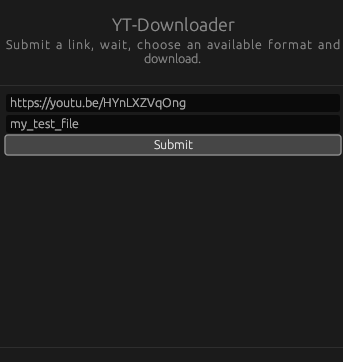
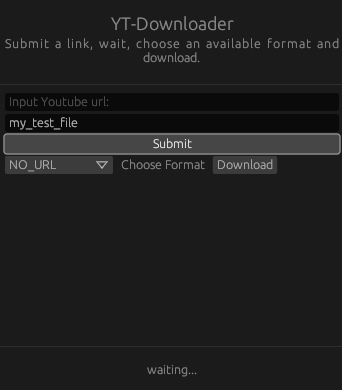
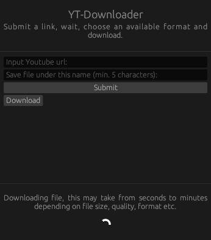
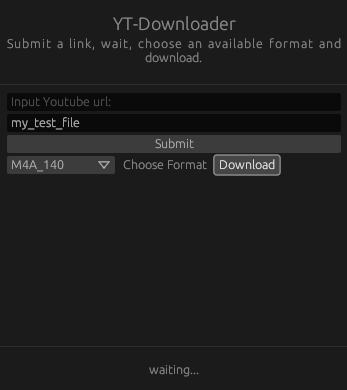
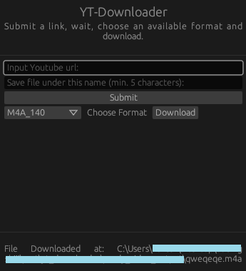

<p align="center">
  
  <h1 align="center">YT-Downloader</h1>
</p>

- [About](#about)
      - [Formats](#formats)
      - [How it works / Why](#how-it-works--why)
- [Install](#install)
      - [With rust installed](#with-rust-installed)
      - [Without rust installed](#without-rust-installed)
- [Addidtional info](#addidtional-info)
- [Screenshots / Demo](#screenshots--demo)
- [Disclaimer](#disclaimer)
- [Authors](#authors)


## About
A Simple Youtube Video Downloader App.

Just Install it , pick out a video , input url and title (can be whatever u want), choose an available format, and simply click the ``download`` button. 

This repo contains the source code, you can build directly from it. It also has a zipped ready version for windows systems. Works only on Windows for now

Trying to support as much video formats as possible, currently only the formats below are supported:

##### Formats
- .3gp
- .flv
- .mp4
- .hls
- .webm (both video & audio)
- .m4a

##### How it works / Why
The first steps are like in any other yt downloader: Get video html, parse it and add some string manipulation to get multiple links. At the end of this there is a ready list of links each to a different format. 

Make user choose format and sends an http request to the url. File begins downloading however instead of simply using the ``.stream()`` method , the ``.stream_bytes`` method was used. The reason here is to have the file be directly written to the filesystem. Without it , the contents would be first downloaded to Memory/RAM and then copied into the filesystem. This could potentially cause large issues with downloading long videos on a machine with not much RAM.

## Install
Both are very straightforward
##### With rust installed
- Can be build from windows

clone repo
```cargo run```

that's it.

##### Without rust installed
- Currently only on windows
  
download project

unzip the ```windows_release.zip```

run the .exe file

## Addidtional info
App will crash: 
  - Due to bad/non YT link
  - If folders with assets are missing

Other:
  - If Cargo.lock is deleted - final file location will not be generated
  - ^ This also causes the download animation to loop forever , even if it has already finished  


## Screenshots / Demo











## Disclaimer

This project was made purely with the intention of learning rust and other educational purposes. The responsibilty regarding what happens to any downloaded content is purely on the side of the end user. As such use it at your own risk. The author holds no responsibilty regarding the use of the tool.

All Rights to any downloaded files still belong to YouTube. 

## Authors

* ThatLukaszGuy

