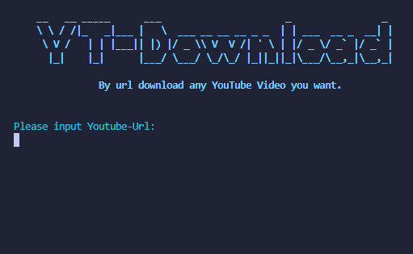
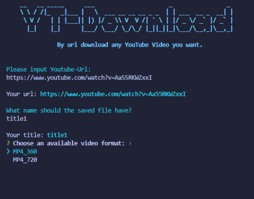
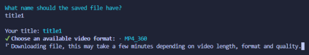
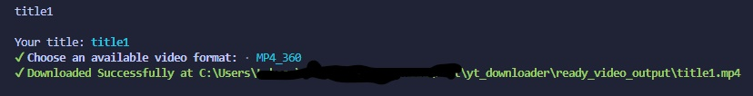

# YT-downloader

Simple - Input Youtube Url, choose format and the video will be downloaded.

This repo is just the source, you can build directly from source. 

Tested only on Windows 10 but should work bug free on unix and unix-like systems.

Trying to support as much video formats as possible

- [YT-downloader](#yt-downloader)
  - [Screenshots / Demo](#screenshots--demo)
  - [License](#license)
  - [Authors](#authors)

## Screenshots / Demo

## License

Distributed under the MIT License. 

## Authors

* ThatLukaszGuy

